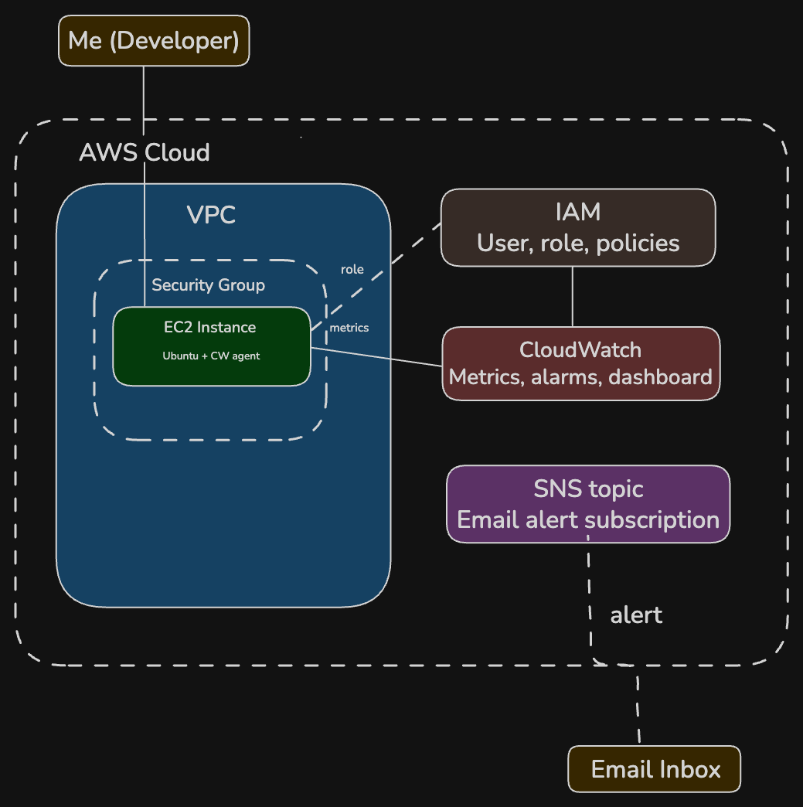
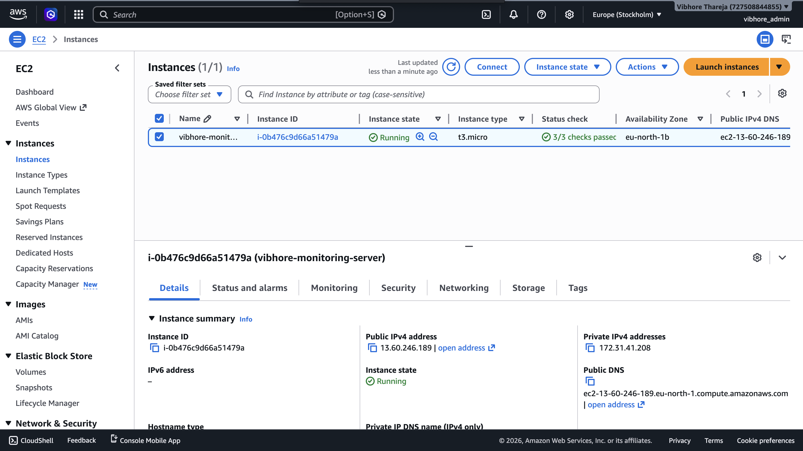
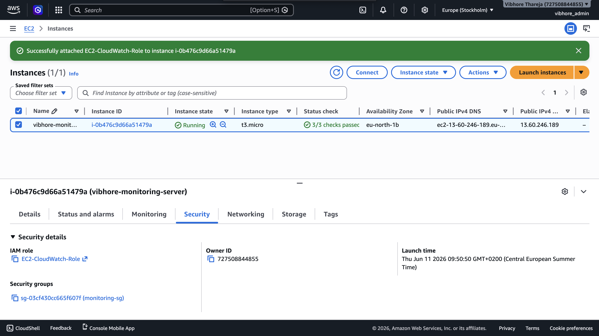
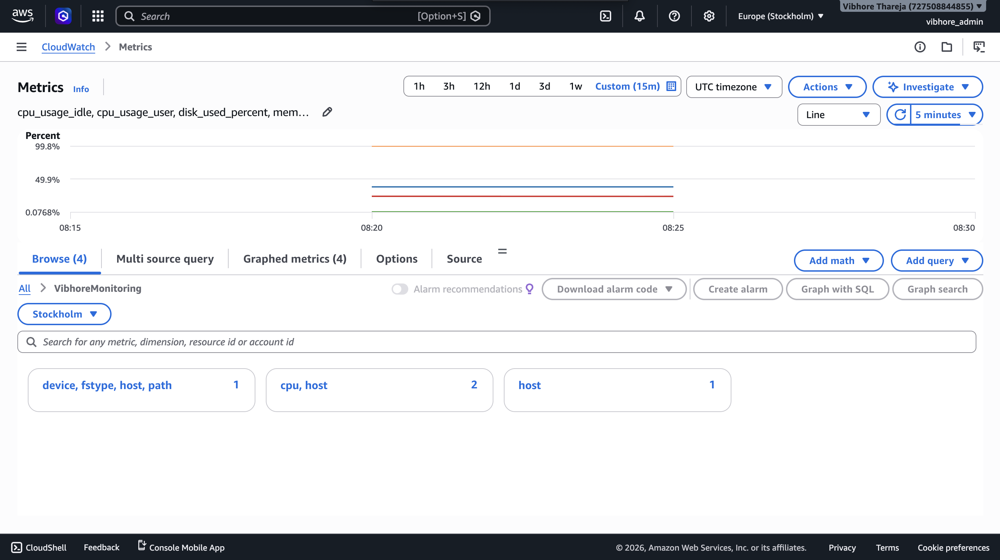
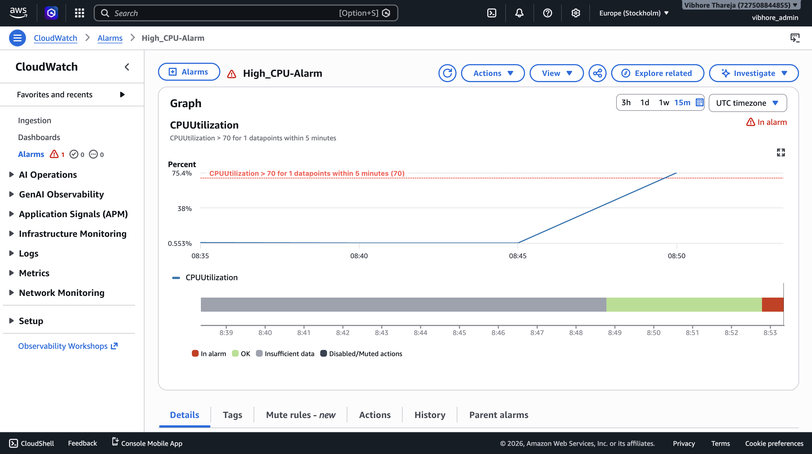
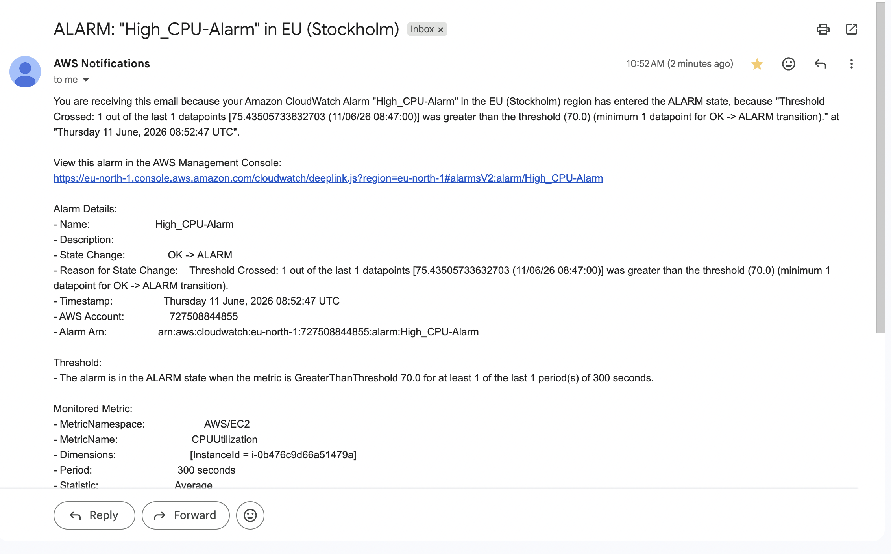
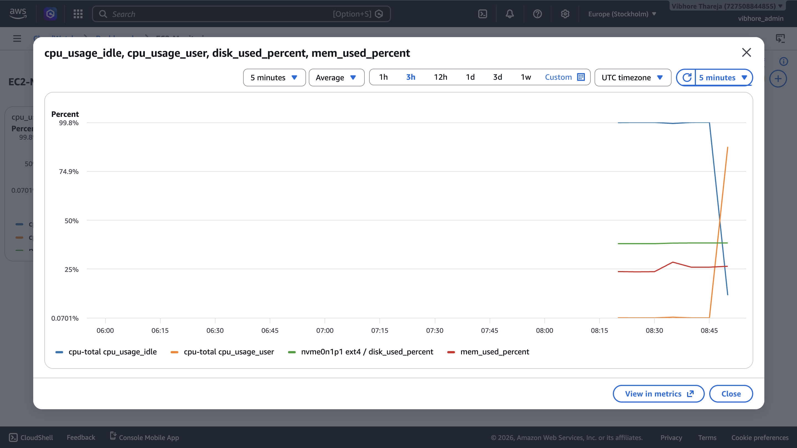

# AWS EC2 Infrastructure Monitoring with CloudWatch & IAM

Deployed and monitored a Linux EC2 instance on AWS using CloudWatch for custom metrics collection, IAM for least-privilege access control, and SNS for automated email alerting. Simulates a real production monitoring setup.

## Architecture



## What this project does

- Launches a t2.micro Ubuntu 22.04 EC2 instance inside a VPC with a restricted security group (SSH only from my IP)
- Attaches an IAM role with `CloudWatchAgentServerPolicy` — following the principle of least privilege
- Installs the CloudWatch agent to collect custom metrics: CPU, memory, and disk (AWS does not monitor memory/disk by default)
- Creates a CloudWatch Alarm that fires when CPU exceeds 70%
- Routes alerts through SNS to email — simulating an on-call alerting pipeline
- All metrics visualized in a CloudWatch dashboard

## Tech stack

| Service | Purpose |
|---------|---------|
| AWS EC2 (t2.micro) | Linux server — Ubuntu 22.04 LTS |
| AWS IAM | Admin user, EC2 role with least-privilege policy |
| AWS VPC + Security Group | Network isolation and port control |
| AWS CloudWatch | Custom metrics, dashboard, CPU alarm |
| AWS SNS | Alert routing to email |
| Linux (Ubuntu) | Server OS, agent installation, stress testing |

## Screenshots

### EC2 instance running


### IAM role attached


### CloudWatch custom metrics (CPU, memory, disk)


### Alarm triggered at CPU > 70%


### SNS email notification received


### Final monitoring dashboard


## Setup

### Prerequisites
- AWS account (Free Tier)
- SSH key pair (`.pem` file)
- Terminal / SSH client

### Key steps

**1. Create IAM admin user + EC2 role**
Create an IAM user with AdministratorAccess. Create a separate IAM role for EC2 with only `CloudWatchAgentServerPolicy`.

**2. Launch EC2 instance**
Ubuntu 22.04, t2.micro, restrict SSH to your IP only. Attach the IAM role.

**3. Install and start the CloudWatch agent**
```bash
wget https://s3.amazonaws.com/amazoncloudwatch-agent/ubuntu/amd64/latest/amazon-cloudwatch-agent.deb
sudo dpkg -i amazon-cloudwatch-agent.deb
sudo /opt/aws/amazon-cloudwatch-agent/bin/amazon-cloudwatch-agent-ctl \
  -a fetch-config -m ec2 \
  -c file:/opt/aws/amazon-cloudwatch-agent/etc/amazon-cloudwatch-agent.json \
  -s
```

**4. Create SNS topic + CloudWatch alarm**
SNS: Standard topic with email subscription. CloudWatch Alarm: CPUUtilization > 70%.

**5. Stress test**
```bash
sudo apt-get install stress -y && stress --cpu 2 --timeout 300
```

## Key concepts demonstrated

**Least privilege IAM**: The EC2 instance only has the permissions it actually needs — not admin access. This is the foundation of AWS security.

**Custom metrics gap**: AWS monitors EC2 CPU by default. Memory and disk require the CloudWatch agent. Knowing this gap and closing it is what separates junior from mid-level cloud work.

**Security group design**: SSH locked to my IP only. HTTP open to the world. This is basic but correct network segmentation.

## What comes next
- Terraform to provision this entire setup as code (removing all manual clicking)
- CloudWatch Logs to collect application logs from EC2
- Auto-scaling triggered by the same CPU alarm
